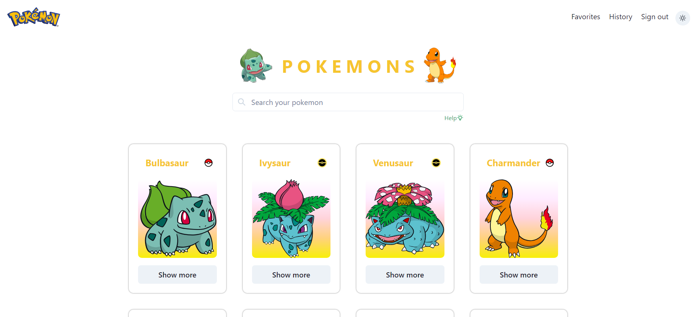
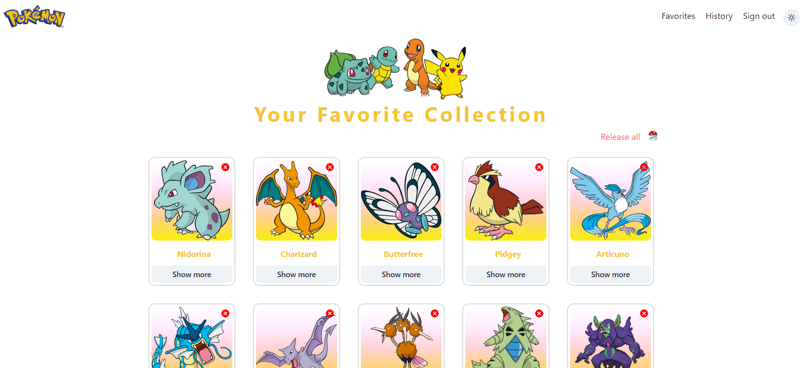
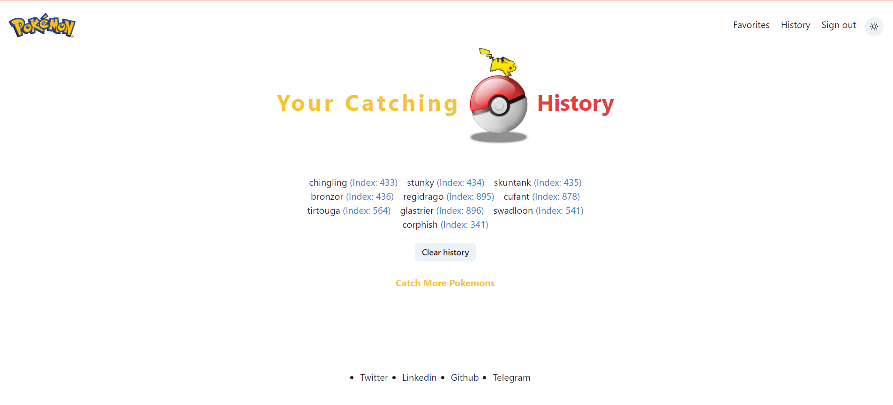
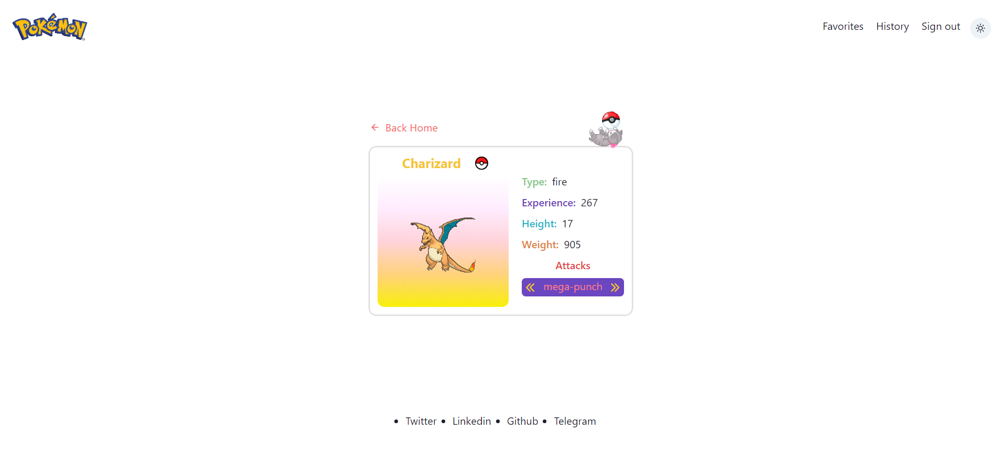

# Pokémons

The Pokémon world is an astonishing and vibrant place, inhabited by a lot of cool creatures, which you can capture and train for various purposes such as companionship or battles.

Let's have an amazing experience by discovering and catching some of the pokemons 🙂

Creation of this app was possible because of this amazing [**_API_**](https://pokeapi.co/)

---

## Have your first encounter with Pokémon World

## Add them to your favorite collection

## Have a history of your catching adventures

## Learn about Pokemons

---

### React

- Проект написан с использованием функциональных компонентов в приоритете над классовыми ✅
- Есть четкое разделение на умные и глупые компоненты ✅ Пример [**глупого**](https://github.com/Kirill3212/aston-project/blob/main/src/components/Footer.tsx) и [**умного**](https://github.com/Kirill3212/aston-project/blob/main/src/components/SearchBarAndDisplay.tsx) компонента
- Есть рендеринг списков ✅ [**Карточки покемонов**](https://github.com/Kirill3212/aston-project/blob/main/src/components/cardsLists/PokemonCardsList.tsx)
- Реализована хотя бы одна форма ✅ [**Форма авторизации**](https://github.com/Kirill3212/aston-project/blob/main/src/components/forms/SignUpForm.tsx)
- Есть применение Контекст API ✅ [**Конткекст**](https://github.com/Kirill3212/aston-project/blob/main/src/components/Layout.tsx)
- Есть применение предохранителя ✅ [**Предохранитель**](https://github.com/Kirill3212/aston-project/blob/main/src/components/ErrorBoundary.tsx) [**его использование**](https://github.com/Kirill3212/aston-project/blob/main/src/routing/router.tsx)
- Есть хотя бы один кастомный хук ✅ [**useCheckIfIsLikedAndAddToFavorites**](https://github.com/Kirill3212/aston-project/blob/main/src/hooks/useCheckIfIsLikedAndAddToFavorites.ts)
- Хотя бы несколько компонентов используют PropTypes ✅ [**Пример использования**](https://github.com/Kirill3212/aston-project/blob/main/src/components/cards/PokemonCardSearch.tsx)
- Поиск не должен триггерить много запросов к серверу ✅ Реализовао с помощью кастомного хука [**useDebounce**](https://github.com/Kirill3212/aston-project/blob/main/src/hooks/useDebounce.ts) - [**Пример использования**](https://github.com/Kirill3212/aston-project/blob/main/src/components/SearchBarAndDisplay.tsx)
- Есть применение lazy + Suspense ✅ (https://github.com/Kirill3212/aston-project/blob/main/src/routing/router.tsx)

### Redux

- Используется Modern Redux with Redux Toolkit ✅
- Используется слайсы ✅ [**Слайсы**](https://github.com/Kirill3212/aston-project/tree/main/src/store/slices)
- Есть кастомная мидлвара ✅ [**Мидлвара**](https://github.com/Kirill3212/aston-project/blob/main/src/store/localStorageListenerMiddleware.ts)
- Используется RTK Query ✅ [**RTK Query**](https://github.com/Kirill3212/aston-project/blob/main/src/api/api.ts)
- Используется Transforming Responses ✅ [**Transforming Responses**](https://github.com/Kirill3212/aston-project/blob/main/src/api/transformResponse.ts)

## Дополнительно

- Используется TypeScript
- Используется UI библиотека - Chakra UI
